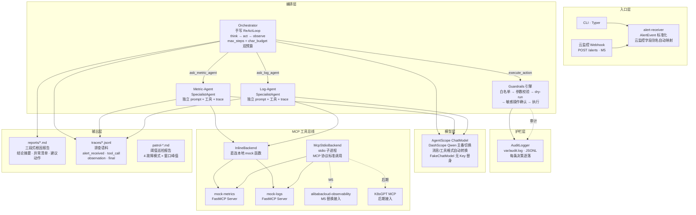

# open-tam · SRE Agent

基于 AgentScope + MCP 的多 Agent 排障系统：告警进来，自动查指标、翻日志，产出结构化根因报告；排查过程全程落盘为语料。

核心定位：**把 TAM 的工作显性化**——排查这类隐性经验变成显式、可读、可评测的资产。新 TAM 照着 trace 入职上手，老 TAM 用报告与账本梳理自己的工作，团队沉淀最佳实践。

## 架构总览



## 功能清单

### M0 · 骨架

| 能力 | 说明 |
|---|---|
| 数据模型 | `AlertEvent`（支持云监控别名自动映射）、`MetricPoint`、`MetricSeries`、`LogRecord`，Pydantic v2 校验 |
| 配置系统 | `Settings` dataclass，环境变量驱动（`DASHSCOPE_API_KEY`、目录路径、模型名、预算参数） |
| CLI 架构 | Typer 多子命令：`metrics` / `logs` / `fault` / `investigate` / `action` / `audit` / `patrol` / `trace` / `version` |
| Demo 服务 | FastAPI `demo_app`：`/health`、`/metrics`、`POST /faults/{name}`、`DELETE /faults/{name}` |

### M1 · 排查闭环

| 能力 | 说明 |
|---|---|
| ReAct 循环 | `orchestrator/loop.py`：think → act → observe 迭代，`max_steps`（默认 15）+ `char_budget`（默认 60K）双预算 |
| 容错设计 | 工具调用异常转 observation 不中断排查，`tool_error` 作为观察继续推理 |
| JSON 提取 | `_extract_json`：`json.JSONDecoder.raw_decode` 逐 `{` 位置尝试，支持 \`\`\`json 代码块和裸 JSON |
| 三段式报告 | `reporting/report.py`：结论摘要 → 异常清单（含已排除项）→ 建议动作 + 排查过程，Markdown 落盘 |
| FakeChatModel | 脚本化模型替身，无 API Key 即可跑通全链路演示与测试 |

### M2 · 多 Agent + 语料

| 能力 | 说明 |
|---|---|
| Orchestrator + 双子 Agent | orchestrator 通过 `ask_metric_agent` / `ask_log_agent` 委托 SpecialistAgent，各自独立 prompt + 工具集 |
| SpecialistAgent | 独立 system prompt、独立工具（`query_metrics` / `query_logs`）、独立 trace，子任务完成后回报 orchestrator |
| MCP 工具总线 | `InlineBackend`（直连）与 `McpStdioBackend`（stdio 子进程）共享同一函数，后端替换零改动 |
| Mock 数据源 | `metrics_data.py`：确定性时序 + 故障窗口 spike；`logs_data.py`：基线日志 + 故障签名 ERROR |
| MCP Server | `metrics_server.py`（FastMCP "mock-metrics"）、`logs_server.py`（FastMCP "mock-logs"），标准 MCP 协议 |
| Trace 语料落盘 | `tracing/trace.py`：每步 alert_received / tool_call / observation / final 逐条 JSONL，按 alert_id 分文件 |

### M3 · 护栏 + 巡检

| 能力 | 说明 |
|---|---|
| Guardrails 引擎 | 白名单校验 → 参数校验（多/缺参数都拒）→ dry-run 预览 → 敏感操作人工确认 → 执行 |
| ActionSpec 注册表 | `clear_fault`（safe）、`restart_service`（safe）、`rollback_release`（sensitive，需确认） |
| Confirmer 协议 | `AutoApprove` / `AutoDeny`（默认失败安全）/ `InteractiveConfirmer` |
| 审计日志 | `AuditLogger`：每个决策（denied / dry_run / executed）逐条 JSONL 落盘 `var/audit.log` |
| GuardrailsBackend | 装饰器模式，`execute_action` 走护栏、其余工具透传，不侵入 ReAct 循环 |
| 故障注入系统 | 4 种故障模式：`cpu_spike` / `slow_query` / `oom` / `connection_pool_exhausted`，`FaultState` JSON 跨进程共享 |
| 阈值巡检 | `patrol.py`：对所有注册故障模式做窗口峰值 vs 阈值检测，产出 Markdown 巡检报告 |
| 定时巡检 | `patrol run`（单次）/ `patrol watch --every-min N`（循环） |

### 模型接入

| 能力 | 说明 |
|---|---|
| AgentScopeChatModel | 封装 DashScope Qwen，主备自动切换（`model_primary` / `model_fallback`） |
| 格式转换 | 消息格式自动转换（dict ↔ Msg/block），工具 schema 自动转 OpenAI function 格式 |
| 环境变量 | `DASHSCOPE_API_KEY`、`OPEN_TAM_MODEL_PRIMARY`（默认 qwen-plus）、`OPEN_TAM_MODEL_FALLBACK`（默认 qwen-turbo）、`OPEN_TAM_MODEL_TIMEOUT`（默认 120s） |

### 工程基建

| 能力 | 说明 |
|---|---|
| CI | GitHub Actions：`uv sync --frozen` → `ruff check .` → `pytest -q` |
| 测试 | 96 passed / 1 skipped，24 个测试文件，覆盖单测 + 集成 + CLI，~1.9s |
| Lint | ruff（E4/E7/E9/F/I/B/UP），target py312 |
| 包管理 | uv + hatchling，`uv.lock` 锁定依赖 |
| GTM 落地页 | `GTM/index.html` 单文件静态页，零构建，可直接部署 |

### 待实现

| 里程碑 | 说明 |
|---|---|
| M4 Web UI | 设计已定稿（SSE 流式排查 + 单页聊天界面），实现待启动 |
| M5 实盘接入 | alibabacloud-observability MCP 替换 mock-metrics、SLS 替换 mock-logs、真实云监控 Webhook |

## 产品主页（GTM 落地页）

页面地址：**[GTM/index.html](GTM/index.html)**（`Open TAM` 产品主页，纯静态单文件，零构建，可直接部署 GitHub Pages 等静态托管）

本地预览：

```bash
python3 -m http.server 8643 --directory GTM
# 浏览器打开 http://127.0.0.1:8643/
```

## 文档

- 架构一页纸：[docs/architecture.md](docs/architecture.md)
- MVP 分阶段清单：[docs/mvp-plan.md](docs/mvp-plan.md)
- 设计文档：[docs/superpowers/specs/2026-08-28-sre-agent-design.md](docs/superpowers/specs/2026-08-28-sre-agent-design.md)
- 产品定位与受众：[PRODUCT.md](PRODUCT.md)
- GTM 页面设计系统契约：[DESIGN.md](DESIGN.md)

## 当前进展

| 里程碑 | 状态 |
|---|---|
| M0 骨架 | 已完成 |
| M1 排查闭环 | 已完成（DashScope qwen-plus 真实模型验收通过） |
| M2 多 Agent + 语料 | 已完成（orchestrator + metric-agent + log-agent，trace 落盘） |
| M3 护栏 + 巡检 | 已完成（2026-08-31 验收：白名单拦截、审计日志、阈值巡检报告、fake 回归） |
| M4 Web UI | 设计已定稿（SSE 流式排查 + 单页聊天界面），实现待启动 |
| M5 实盘接入 | 规划中（云监控 webhook + alibabacloud-observability MCP + SLS） |

## 快速开始

```bash
uv sync                          # Python 3.12，自动创建 .venv
uv run pytest -q                 # 全量测试
uv run ruff check .              # 代码检查（CI 同款）
```

## 无 Key 演示（FakeChatModel 闭环）

```bash
uv run open-tam fault inject cpu_spike
echo '{"alert_name":"CPU使用率过高","service":"demo-app","metric":"cpu_usage","threshold":80,"current_value":92.5}' > /tmp/alert.json
uv run open-tam investigate --alert-file /tmp/alert.json --fake
uv run open-tam fault clear cpu_spike
cat reports/*.md                 # 三段式根因报告
```

## 真实模型排查（DashScope Qwen）

```bash
export DASHSCOPE_API_KEY=sk-...
uv run open-tam investigate --alert-file /tmp/alert.json
```

主备模型可通过 `OPEN_TAM_MODEL_PRIMARY` / `OPEN_TAM_MODEL_FALLBACK` 配置，默认 `qwen-plus` / `qwen-turbo`；单次调用超时秒数用 `OPEN_TAM_MODEL_TIMEOUT` 配置（默认 120）。

## 评测基线

```bash
uv run open-tam eval --fake                       # 无 Key：脚本回放，验证评测链路
export DASHSCOPE_API_KEY=sk-...
uv run open-tam eval                              # 真实模型：4 种故障 × 1 次
uv run open-tam eval --faults cpu_spike --runs 3  # 指定故障、重复多次
```

报告落盘 `reports/eval-<时间戳>.md`，含根因定位率、关键词命中率、平均步数与耗时。

## 常用命令

| 命令 | 说明 |
|---|---|
| `open-tam metrics query --metric cpu_usage --service demo-app --start <iso> --end <iso>` | 查指标（`--transport mcp` 走 MCP stdio 后端） |
| `open-tam fault inject cpu_spike` / `fault clear cpu_spike` / `fault list` | 故障注入 |
| `open-tam investigate --alert-file <json> [--fake] [--transport mcp]` | 排查闭环，报告落盘 `reports/` |
| `open-tam eval [--fake] [--faults a,b] [--runs N]` | 批量评测：根因定位率/关键词命中率/平均步数 |
| `uvicorn demo_app.app:app --port 8000` | 启动被诊断对象 demo-app（`/health` `/metrics` `/faults`） |
| `uv run python -m open_tam.mcp_servers.metrics_server` | 启动 mock-metrics MCP stdio 服务 |
| `open-tam logs query --service demo-app --start <iso> --end <iso> [--level ERROR] [--keyword slow]` | 查日志（双后端同 metrics） |
| `open-tam trace show <alert-id>` | 回放某次排查的 JSONL（含子 Agent 内部步骤） |
| `open-tam action list` | 查看白名单动作注册表 |
| `open-tam action run clear_fault --arg name=cpu_spike` | 执行白名单动作（safe 直接执行） |
| `open-tam action run rollback_release --arg service=demo-app` | 敏感动作：交互确认后执行 |
| `open-tam action run rollback_release --arg service=demo-app --yes` | 敏感动作：跳过确认 |
| `open-tam action run any --dry-run` | dry-run 预览，不实际执行 |
| `open-tam audit show` | 查看审计日志（JSONL） |
| `open-tam patrol run` | 立即巡检一次，产出巡检报告 |
| `open-tam patrol watch --every-min 5` | 每 5 分钟巡检一次（Ctrl-C 退出） |
| `open-tam serve [--host 127.0.0.1] [--port 8000]` | 启动 Web UI（聊天式流式排查） |

## 已知环境注意事项

- macOS + Python 3.12.13+：`.venv` 内 editable `.pth` 若被标记 hidden（`UF_HIDDEN`），Python 会跳过它导致 `open_tam` 不可导入（本环境已观察到周期性复现）。修复：`chflags nohidden .venv/lib/python3.12/site-packages/*.pth`；pytest 已配置 `pythonpath = ["src"]` 不受影响。 彻底规避：`export UV_NO_EDITABLE=1` 后用非 editable 安装（pytest 已配置 `pythonpath = ["src"]` 不受影响）。
