# open-tam · SRE Agent

基于 AgentScope + MCP 的多 Agent 排障系统：告警进来，自动查指标、翻日志，产出结构化根因报告；排查过程全程落盘为语料。

核心定位：**把 TAM 的工作显性化**——排查这类隐性经验变成显式、可读、可评测的资产。新 TAM 照着 trace 入职上手，老 TAM 用报告与账本梳理自己的工作，团队沉淀最佳实践。

## 架构总览

```mermaid
flowchart TB
    subgraph 入口层
        CLI[CLI · Typer]
        WH[告警 Webhook<br/>POST /alerts · HMAC 签名验证]
        AD[adapters 多格式适配<br/>cms / alertmanager / native]
        DD[AlertDedup 滑窗去重<br/>默认 300s]
        AR[alert-receiver<br/>AlertEvent 标准化]
        CLI --> AR
        WH --> AD --> DD --> AR
    end

    subgraph 风暴处理
        CORR[AlertCorrelator<br/>时间窗口 + 服务重叠 + 依赖关联聚合]
        PQ[PriorityQueue<br/>P0–P3 优先级 · P0 抢占]
        AR -.风暴场景.-> CORR --> PQ
    end

    subgraph 编排层
        ORC[Orchestrator<br/>手写 ReActLoop<br/>think → act → observe<br/>max_steps + char_budget 双预算]
        SKILL[Skill 注入<br/>按告警名匹配最高置信度模板<br/>拼入 system prompt]
        MA[Metric-Agent]
        LA[Log-Agent]
        KA[K8s-Agent<br/>query_k8s_events / pod_status<br/>node_status / analyze_with_k8sgpt]
        SKILL -.模板.-> ORC
        ORC -- ask_metric_agent --> MA
        ORC -- ask_log_agent --> LA
        ORC -- ask_k8s_agent --> KA
        ORC -- execute_action --> GR
    end

    subgraph 知识层
        EXT[Skill Extractor<br/>从 traces 提取排查模板<br/>+0.1 置信度/条]
        LD[SkillLoader<br/>YAML 存储 · fnmatch 匹配]
        EXT --> LD
        LD -.-> SKILL
    end

    subgraph 护栏与动作层
        GR[Guardrails 引擎<br/>白名单 → 参数校验 → dry-run<br/>→ 敏感操作确认 → 执行]
        AUD[AuditLogger · JSONL 逐条审计]
        PB[PlaybookExecutor<br/>YAML 编排 · on_failure abort/continue/rollback<br/>confidence_threshold 门槛]
        GR --> AUD
        PB --> GR
    end

    subgraph 模型层
        LLM[AgentScope ChatModel<br/>DashScope Qwen 主备切换<br/>FakeChatModel 无 Key 替身]
        JUDGE[EvidenceJudge<br/>LLM-as-Judge 证据充分性 0–1 评分]
        ORC --> LLM
        MA --> LLM
        LA --> LLM
        KA --> LLM
    end

    subgraph MCP 工具总线
        direction LR
        IB[InlineBackend<br/>直连本地 mock 函数]
        MCP[McpStdioBackend<br/>按 metrics_backend / logs_backend<br/>配置路由 mock 或 aliyun]
        MRB[MultiRegionBackend<br/>OPEN_TAM_REGIONS 多区域<br/>并行 fan-out + 错误隔离聚合]
        MM[mock-metrics<br/>mock-logs]
        ALI[aliyun-metrics CMS<br/>aliyun-logs SLS]
        K8S[mock-k8s<br/>K8sGPT 风格 4 工具]
        IB --> MM
        MCP --> MM
        MCP --> ALI
        MCP --> K8S
        MRB -.多区域 fan-out.-> IB
        MRB -.多区域 fan-out.-> MCP
    end

    MA --> IB
    LA --> IB
    KA --> IB

    subgraph 平台层
        DB[(SQLite WAL<br/>users / investigations<br/>alerts / audit_entries)]
        AUTH[AuthMiddleware<br/>X-API-Key / Bearer<br/>admin / operator / viewer]
        NOTI[通知集成<br/>钉钉 / 飞书 / Slack webhook]
        AUTH --> DB
    end

    subgraph 输出层
        REP[reports/*.md 三段式根因报告]
        TRC[traces/*.jsonl 排查语料]
        EVAL[reports/eval-*.md<br/>定位率/关键词命中/平均步数<br/>A/B 对比报告]
        PAT[patrol-*.md 阈值巡检<br/>8 故障模式]
    end

    ORC --> REP
    ORC --> TRC
    MA --> TRC
    LA --> TRC
    KA --> TRC
    ORC -.完成事件.-> NOTI
    TRC -.语料.-> EXT
```



## 功能清单

### M0 · 骨架

| 能力 | 说明 |
|---|---|
| 数据模型 | `AlertEvent`（支持云监控别名自动映射）、`MetricPoint`、`MetricSeries`、`LogRecord`，Pydantic v2 校验 |
| 配置系统 | `Settings` dataclass，环境变量驱动（`DASHSCOPE_API_KEY`、目录路径、模型名、预算参数） |
| CLI 架构 | Typer 多子命令：`metrics` / `logs` / `fault` / `investigate` / `action` / `audit` / `patrol` / `trace` / `version` |
| Demo 服务 | FastAPI `demo_app`：`/health`、`/metrics`、`POST /faults/{name}`、`DELETE /faults/{name}` |

### M1 · 排查闭环

| 能力 | 说明 |
|---|---|
| ReAct 循环 | `orchestrator/loop.py`：think → act → observe 迭代，`max_steps`（默认 15）+ `char_budget`（默认 60K）双预算 |
| 容错设计 | 工具调用异常转 observation 不中断排查，`tool_error` 作为观察继续推理 |
| JSON 提取 | `_extract_json`：`json.JSONDecoder.raw_decode` 逐 `{` 位置尝试，支持 \`\`\`json 代码块和裸 JSON |
| 三段式报告 | `reporting/report.py`：结论摘要 → 异常清单（含已排除项）→ 建议动作 + 排查过程，Markdown 落盘 |
| FakeChatModel | 脚本化模型替身，无 API Key 即可跑通全链路演示与测试 |

### M2 · 多 Agent + 语料

| 能力 | 说明 |
|---|---|
| Orchestrator + 双子 Agent | orchestrator 通过 `ask_metric_agent` / `ask_log_agent` 委托 SpecialistAgent，各自独立 prompt + 工具集 |
| SpecialistAgent | 独立 system prompt、独立工具（`query_metrics` / `query_logs`）、独立 trace，子任务完成后回报 orchestrator |
| MCP 工具总线 | `InlineBackend`（直连）与 `McpStdioBackend`（stdio 子进程）共享同一函数，后端替换零改动 |
| Mock 数据源 | `metrics_data.py`：确定性时序 + 故障窗口 spike；`logs_data.py`：基线日志 + 故障签名 ERROR |
| MCP Server | `metrics_server.py`（FastMCP "mock-metrics"）、`logs_server.py`（FastMCP "mock-logs"），标准 MCP 协议 |
| Trace 语料落盘 | `tracing/trace.py`：每步 alert_received / tool_call / observation / final 逐条 JSONL，按 alert_id 分文件 |

### M3 · 护栏 + 巡检

| 能力 | 说明 |
|---|---|
| Guardrails 引擎 | 白名单校验 → 参数校验（多/缺参数都拒）→ dry-run 预览 → 敏感操作人工确认 → 执行 |
| ActionSpec 注册表 | `clear_fault`（safe）、`restart_service`（safe）、`rollback_release`（sensitive，需确认） |
| Confirmer 协议 | `AutoApprove` / `AutoDeny`（默认失败安全）/ `InteractiveConfirmer` |
| 审计日志 | `AuditLogger`：每个决策（denied / dry_run / executed）逐条 JSONL 落盘 `var/audit.log` |
| GuardrailsBackend | 装饰器模式，`execute_action` 走护栏、其余工具透传，不侵入 ReAct 循环 |
| 故障注入系统 | 4 种故障模式：`cpu_spike` / `slow_query` / `oom` / `connection_pool_exhausted`，`FaultState` JSON 跨进程共享 |
| 阈值巡检 | `patrol.py`：对所有注册故障模式做窗口峰值 vs 阈值检测，产出 Markdown 巡检报告 |
| 定时巡检 | `patrol run`（单次）/ `patrol watch --every-min N`（循环） |

### 模型接入

| 能力 | 说明 |
|---|---|
| AgentScopeChatModel | 封装 DashScope Qwen，主备自动切换（`model_primary` / `model_fallback`） |
| 格式转换 | 消息格式自动转换（dict ↔ Msg/block），工具 schema 自动转 OpenAI function 格式 |
| 环境变量 | `DASHSCOPE_API_KEY`、`OPEN_TAM_MODEL_PRIMARY`（默认 qwen-plus）、`OPEN_TAM_MODEL_FALLBACK`（默认 qwen-turbo）、`OPEN_TAM_MODEL_TIMEOUT`（默认 120s） |

### 工程基建

| 能力 | 说明 |
|---|---|
| CI | GitHub Actions：`uv sync --frozen` → `ruff check .` → `pytest -q` |
| 测试 | 294 passed / 1 skipped，34 个测试文件，覆盖单测 + 集成 + CLI + 全部里程碑 |
| Lint | ruff（E4/E7/E9/F/I/B/UP），target py312 |
| 包管理 | uv + hatchling，`uv.lock` 锁定依赖 |
| GTM 落地页 | `GTM/index.html` 单文件静态页，零构建，可直接部署 |

### M4 · Web UI

| 能力 | 说明 |
|---|---|
| 单页聊天界面 | `web/static/index.html` 单文件前端（内嵌 CSS/JS，零构建）：故障模板一键注入 + 告警预填 + 流式时间线 |
| SSE 流式排查 | `POST /api/investigations` 202 受理 → `GET /api/investigations/{id}/events` 流式推送；刷新重连按快照重放不丢事件 |
| InvestigationHub | 内存会话注册表 + 事件广播：TraceRecorder sink 旁路回调（trace JSONL 仍是唯一事实源），线程→asyncio 桥接 |
| 核心复用 | `orchestrator/investigate.py: run_investigation` 排查组装主体，CLI 与 Web 共用同一路径 |
| 子 Agent 区分 | orchestrator / metric / log 事件按 `agent` 字段配色区分，观察可折叠展开 |

### M5 · 实盘接入

| 能力 | 说明 |
|---|---|
| 多格式告警适配 | `receiver/adapters.py`：cms（云监控）/ alertmanager / native 自动检测，P1–P4 severity 映射 |
| Webhook 签名验证 | HMAC-SHA256 `X-Signature`（`OPEN_TAM_WEBHOOK_SECRET`），滑窗去重（默认 300s，同告警名+服务） |
| 阿里云 MCP 后端 | `aliyun_metrics_server`（CMS DescribeMetricData）/ `aliyun_logs_server`（SLS），工具签名与 mock 完全一致 |
| 后端路由 | `OPEN_TAM_METRICS_BACKEND` / `OPEN_TAM_LOGS_BACKEND` = `mock` \| `aliyun`，排查代码零改动切换 |

### M6 · 知识沉淀与 Skill 系统

| 能力 | 说明 |
|---|---|
| trace → Skill | `skill learn` 批量从 traces 提取工具调用序列 + 根因模板，按告警名/服务 fnmatch 聚合，每多一条 trace 置信度 +0.1 |
| Skill 注入 | 排查时按告警名匹配最高置信度模板，拼入 orchestrator system prompt |
| Skill 管理 | YAML 存储：`skill learn / list / show / delete`；支持手写 YAML |
| Web 知识库 | 知识库标签页：GET /api/skills 置信度降序 + 详情懒加载 + 删除（仅 manage_skills 角色）；排查 done 事件提示命中的历史经验（skill_used） |

### M7 · 多租户与生产化

| 能力 | 说明 |
|---|---|
| SQLite 持久化 | WAL 模式 + 版本迁移（`db migrate`）：users / investigations / alerts / audit_entries |
| API Key 认证 | `AuthMiddleware`：`X-API-Key` 或 `Bearer`；角色 admin / operator / viewer（读写/排查/管用户权限集） |
| 通知集成 | 钉钉 / 飞书 / Slack webhook（markdown 消息，fail-soft）：排查完成、动作确认事件 |
| 历史检索 | `history list / show` 排查历史持久化与查询 |
| Web 生产化 | 登录遮罩（API Key）+ 排查历史标签页 + 敏感操作 SSE 确认弹窗（WebConfirmer 120s 超时 fail-safe 拒绝，CLI 路径保持 AutoDeny） |

### M8 · K8s 与基础设施排障

| 能力 | 说明 |
|---|---|
| K8sGPT 风格 MCP | `k8s_server.py` 四工具：`query_k8s_events` / `query_pod_status` / `query_node_status` / `analyze_with_k8sgpt` |
| k8s-agent | 第三子 Agent，与 metric/log-agent 并列；Pod/Node/DNS/证书类问题委托给它 |
| 新故障模式 | `pod_crash_loop` / `node_not_ready` / `dns_failure` / `cert_expiry`（总计 8 种，均带 eval_keywords） |

### M9 · 高级评测与质量闭环

| 能力 | 说明 |
|---|---|
| LLM-as-Judge | `EvidenceJudge`：证据充分性锚定评分 0.0–1.0（根因准确性 + 证据链），纳入 eval 流程 |
| A/B 模型对比 | `open-tam eval-compare`：多模型 × 故障集对比，Markdown 报告含指标表 + 逐故障明细 |
| CI 质量门 | `open-tam eval --min-hit-rate 0.8`：定位率低于阈值退出码 1，可直接接 CI |
| Web 评测标签页 | eval 结果落库 eval_runs（schema v2 迁移）：SVG 趋势折线图 + A/B 对比表 + runs 明细懒加载（GET /api/evals） |

### M10 · 告警风暴与高级编排

| 能力 | 说明 |
|---|---|
| 告警关联聚合 | `AlertCorrelator`：时间窗口 + 服务重叠 + 依赖配置 → AlertGroup，风暴降噪 |
| 优先级排查队列 | `PriorityQueue`（heapq）：P0–P3 分级，P0 抢占 P2 |
| 修复 Playbook | YAML 定义（敏感度/auto_execute/on_failure=abort\|continue\|rollback/confidence_threshold），经 Guardrails 逐条执行 |
| 跨集群/跨区域 | `OPEN_TAM_REGIONS`（逗号分隔）多区域配置：MultiRegionBackend 并行 fan-out query_metrics/query_logs 聚合为 `{"regions": [...]}`，单区域错误隔离，其余工具透传主区域；`fault inject --region` 区域级故障 |

## 产品主页（GTM 落地页）

页面地址：**[GTM/index.html](GTM/index.html)**（`Open TAM` 产品主页，纯静态单文件，零构建，可直接部署 GitHub Pages 等静态托管）

本地预览：

```bash
python3 -m http.server 8643 --directory GTM
# 浏览器打开 http://127.0.0.1:8643/
```

## 文档

- 架构一页纸：[docs/architecture.md](docs/architecture.md)
- MVP 分阶段清单：[docs/mvp-plan.md](docs/mvp-plan.md)
- 设计文档：[docs/superpowers/specs/2026-08-28-sre-agent-design.md](docs/superpowers/specs/2026-08-28-sre-agent-design.md)
- M4 Web UI 设计：[docs/superpowers/specs/2026-08-31-m4-web-ui-design.md](docs/superpowers/specs/2026-08-31-m4-web-ui-design.md)
- M5–M10 路线图设计：[docs/superpowers/specs/2026-09-08-m5-to-m10-roadmap-design.md](docs/superpowers/specs/2026-09-08-m5-to-m10-roadmap-design.md)
- 产品定位与受众：[PRODUCT.md](PRODUCT.md)
- GTM 页面设计系统契约：[DESIGN.md](DESIGN.md)

## 当前进展

| 里程碑 | 状态 |
|---|---|
| M0 骨架 | 已完成 |
| M1 排查闭环 | 已完成（DashScope qwen-plus 真实模型验收通过） |
| M2 多 Agent + 语料 | 已完成（orchestrator + metric-agent + log-agent，trace 落盘） |
| M3 护栏 + 巡检 | 已完成（白名单拦截、审计日志、阈值巡检报告、fake 回归） |
| M4 Web UI | 已完成（SSE 流式排查 + 单页聊天界面，浏览器 golden path 验收 + 刷新重放） |
| M5 实盘接入 | 已完成（多格式 webhook + 签名/去重 + aliyun CMS/SLS MCP 后端路由） |
| M6 知识沉淀 | 已完成（trace 提取 Skill + 匹配注入 + CLI 管理 + Web 知识库标签页） |
| M7 多租户与生产化 | 已完成（SQLite 持久化 + API Key 认证 + 通知集成 + Web 登录/历史/敏感操作确认） |
| M8 K8s 排障 | 已完成（K8sGPT 风格 MCP + k8s-agent + 4 种新故障模式） |
| M9 高级评测 | 已完成（LLM-as-Judge + A/B 对比 + CI 质量门 + Web 评测标签页） |
| M10 告警风暴与高级编排 | 已完成（关联聚合 + 优先级队列 + Playbook 修复编排 + 跨集群/跨区域排查） |

## 快速开始

```bash
uv sync                          # Python 3.12，自动创建 .venv
uv run pytest -q                 # 全量测试
uv run ruff check .              # 代码检查（CI 同款）
```

## 无 Key 演示（FakeChatModel 闭环）

```bash
uv run open-tam fault inject cpu_spike
echo '{"alert_name":"CPU使用率过高","service":"demo-app","metric":"cpu_usage","threshold":80,"current_value":92.5}' > /tmp/alert.json
uv run open-tam investigate --alert-file /tmp/alert.json --fake
uv run open-tam fault clear cpu_spike
cat reports/*.md                 # 三段式根因报告
```

## 真实模型排查（DashScope Qwen）

```bash
export DASHSCOPE_API_KEY=sk-...
uv run open-tam investigate --alert-file /tmp/alert.json
```

主备模型可通过 `OPEN_TAM_MODEL_PRIMARY` / `OPEN_TAM_MODEL_FALLBACK` 配置，默认 `qwen-plus` / `qwen-turbo`；单次调用超时秒数用 `OPEN_TAM_MODEL_TIMEOUT` 配置（默认 120）。

## 评测基线

```bash
uv run open-tam eval --fake                       # 无 Key：脚本回放，验证评测链路
export DASHSCOPE_API_KEY=sk-...
uv run open-tam eval                              # 真实模型：4 种故障 × 1 次
uv run open-tam eval --faults cpu_spike --runs 3  # 指定故障、重复多次
```

报告落盘 `reports/eval-<时间戳>.md`，含根因定位率、关键词命中率、平均步数与耗时。

## 常用命令

| 命令 | 说明 |
|---|---|
| `open-tam metrics query --metric cpu_usage --service demo-app --start <iso> --end <iso>` | 查指标（`--transport mcp` 走 MCP stdio 后端） |
| `open-tam fault inject cpu_spike [--region cn-hangzhou]` / `fault clear cpu_spike` / `fault list` | 故障注入（缺 region 全局生效，指定 region 仅该区域异常） |
| `open-tam investigate --alert-file <json> [--fake] [--transport mcp]` | 排查闭环，报告落盘 `reports/` |
| `open-tam eval [--fake] [--faults a,b] [--runs N]` | 批量评测：根因定位率/关键词命中率/平均步数，结果自动落库 eval_runs（Web 评测标签页展示趋势） |
| `uvicorn demo_app.app:app --port 8000` | 启动被诊断对象 demo-app（`/health` `/metrics` `/faults`） |
| `uv run python -m open_tam.mcp_servers.metrics_server` | 启动 mock-metrics MCP stdio 服务 |
| `open-tam logs query --service demo-app --start <iso> --end <iso> [--level ERROR] [--keyword slow]` | 查日志（双后端同 metrics） |
| `open-tam trace show <alert-id>` | 回放某次排查的 JSONL（含子 Agent 内部步骤） |
| `open-tam action list` | 查看白名单动作注册表 |
| `open-tam action run clear_fault --arg name=cpu_spike` | 执行白名单动作（safe 直接执行） |
| `open-tam action run rollback_release --arg service=demo-app` | 敏感动作：交互确认后执行 |
| `open-tam action run rollback_release --arg service=demo-app --yes` | 敏感动作：跳过确认 |
| `open-tam action run any --dry-run` | dry-run 预览，不实际执行 |
| `open-tam audit show` | 查看审计日志（JSONL） |
| `open-tam patrol run` | 立即巡检一次，产出巡检报告 |
| `open-tam patrol watch --every-min 5` | 每 5 分钟巡检一次（Ctrl-C 退出） |
| `open-tam serve [--host 127.0.0.1] [--port 8000]` | 启动 Web UI（聊天式流式排查） |
| `open-tam skill learn --traces traces/` | 从 trace 语料批量提取排查 Skill |
| `open-tam skill list` / `skill show <name>` / `skill delete <name>` | Skill 管理（YAML 存储） |
| `open-tam user create --role admin` | 创建用户（API Key 仅创建时打印一次） |
| `open-tam db migrate` | SQLite 版本迁移 |
| `open-tam history list` / `history show <id>` | 排查历史持久化检索 |
| `open-tam eval-compare --models a,b` | A/B 模型对比评测 |

## 已知环境注意事项

- macOS + Python 3.12.13+：`.venv` 内 editable `.pth` 若被标记 hidden（`UF_HIDDEN`），Python 会跳过它导致 `open_tam` 不可导入（本环境已观察到周期性复现）。修复：`chflags nohidden .venv/lib/python3.12/site-packages/*.pth`；pytest 已配置 `pythonpath = ["src"]` 不受影响。 彻底规避：`export UV_NO_EDITABLE=1` 后用非 editable 安装（pytest 已配置 `pythonpath = ["src"]` 不受影响）。
