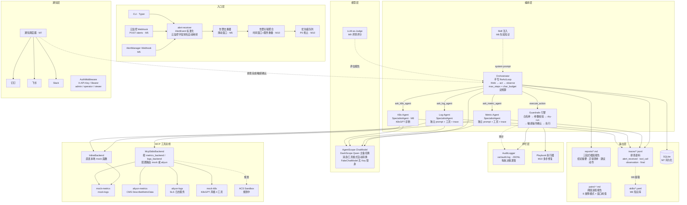

# open-tam · SRE Agent 架构一页纸

**一句话定位**：基于 AgentScope + MCP 的多 Agent 排障系统——告警进来，自动查指标、翻日志，产出结构化根因报告；排查过程全程落盘为语料。

## 架构图

## 核心设计原则

1. **MCP 工具总线统一接口**：`query_metrics` / `query_logs` 签名固定，mock 与 aliyun 后端按 `metrics_backend` / `logs_backend` 配置路由，排查代码零改动。
2. **大脑与手脚分离**：编排层只做推理与调度，数据获取全部走 MCP；高危命令执行迁入 ACS Agent Sandbox（规划）。
3. **排查即语料**：每步思考/工具调用/观察落 JSONL，报告与 trace 都可回流语料库、沉淀 Skill。
4. **护栏前置**：命令白名单 + dry-run + 敏感操作人工确认 + 审计逐条落盘；Playbook 修复也经 Guardrails 逐条执行。
5. **Skill 反哺**（M6 起）：历史排查经验提取为 Skill，注入 system prompt 作为先验知识，不限制 LLM 自由度。

> 分层说明：ReAct 排查循环自研（`orchestrator/loop.py`）；AgentScope 仅用于模型接入（`orchestrator/llm.py`），负责 DashScope 调用、主备切换与消息/工具格式转换。

## 替换路径（mock → 实盘）

| MVP 阶段 | 后期替换为 | 接入里程碑 |
|---|---|---|
| mock-metrics-mcp-server | alibabacloud-observability MCP（云监控指标） | M5 |
| mock-logs-mcp-server | SLS 日志服务（同 MCP 框架接入） | M5 |
| 本地白名单沙箱 | ACS Agent Sandbox（MicroVM 隔离） | M8 |
| 云监控 Webhook（M5 起） | 真实告警源 | M5 |
| JSON 文件存储 | SQLite → PostgreSQL | M7 |
| 无 Skill 系统 | trace → Skill → system prompt 注入 | M6 |
| 单 Agent 排障 | + k8s-agent（K8sGPT） | M8 |
| 手动评测 | LLM-as-Judge + A/B 对比 + CI 集成 | M9 |
| 串行排查 | 告警关联聚合 + 优先级队列 | M10 |
| 单步动作 | 修复 Playbook 多步编排 | M10 |

## 演进路线

M0 骨架 → M1 排查闭环 → M2 多 Agent + 语料落盘 → M3 护栏 + 巡检 → M4 Web UI → M5 实盘接入 → M6 知识沉淀与 Skill 系统 → M7 多租户与生产化 → M8 K8s 与基础设施排障 → M9 高级评测与质量闭环 → M10 告警风暴与高级编排

> 全阶段详细设计见 `docs/superpowers/specs/2026-09-08-m5-to-m10-roadmap-design.md`
