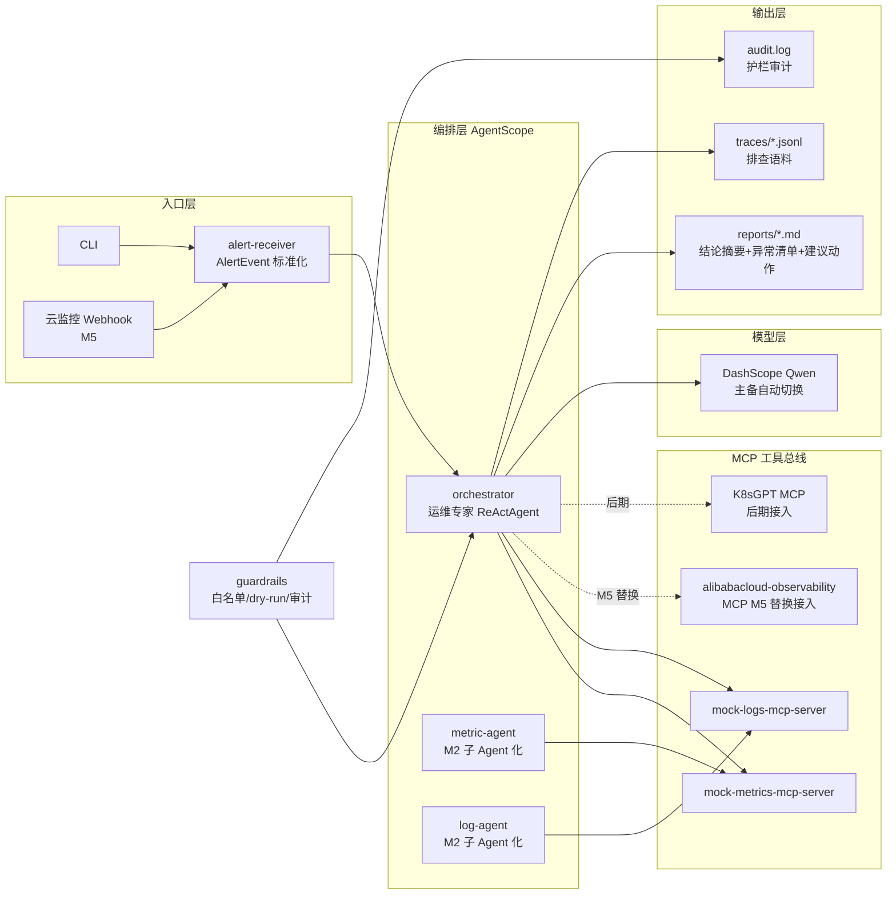

# open-tam · SRE Agent 架构一页纸

**一句话定位**：基于 AgentScope + MCP 的多 Agent 排障系统——告警进来，自动查指标、翻日志，产出结构化根因报告；排查过程全程落盘为语料。

## 架构图

## 核心设计原则

1. **MCP 工具总线统一接口**：`query_metrics` / `query_logs` 签名固定，mock 与真实后端（alibabacloud-observability MCP）可互换，排查代码零改动。
2. **大脑与手脚分离**：编排层只做推理与调度，数据获取全部走 MCP；后期高危命令执行迁入 ACS Agent Sandbox。
3. **排查即语料**：每步思考/工具调用/观察落 JSONL，报告与 trace 都可回流语料库、沉淀 Skill。
4. **护栏前置**：命令白名单 + dry-run + 敏感操作人工确认，M3 起生效。

## 替换路径（mock → 实盘）

| MVP 阶段 | 后期替换为 |
|---|---|
| mock-metrics-mcp-server | alibabacloud-observability MCP（云监控指标） |
| mock-logs-mcp-server | SLS 日志服务（同 MCP 框架接入） |
| 本地白名单沙箱 | ACS Agent Sandbox（MicroVM 隔离） |
| 云监控 Webhook（M5 起） | 真实告警源 |

## 演进路线

M0 骨架 → M1 排查闭环 → M2 多 Agent + 语料落盘 → M3 护栏 + 巡检 → M4 Web UI → M5 实盘接入 →（K8sGPT · ACS Sandbox · OpenSRE 式评测）
